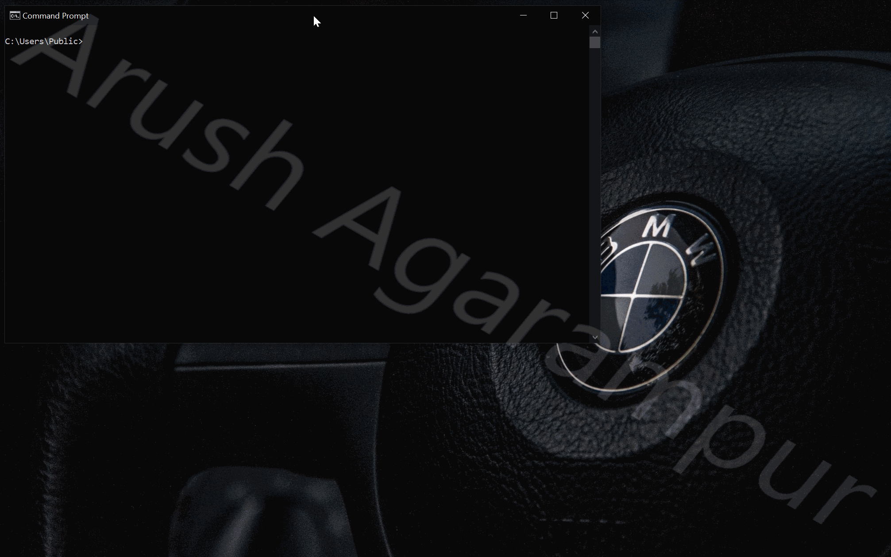

# ByeIntegrity 4.0 — Windows UAC Bypass
The fourth attack to bypass User Account Control (UAC) and gain elevated (Administrator) privileges to run any program at a high integrity level.


## Requirements
- Administrator account
- UAC notification level set to default or lower

## How it works
ByeIntegrity 4.0 uses the same attack methods ByeIntegrity 3.0 uses. However, ByeIntegrity 4.0 has one more crucial method that allows this attack to be possible — environment variable modification.

ByeIntegrity 4.0 modifies the `windir` environment variable for the current user to represent a custom "WINDOWS" folder. It then creates a URL protocol called `protocol-byeintegrity4` and uses the `UserAssocSet()` calls to make `cmd.exe` open this protocol. The autoelevated COM interface `IFwCplLua`, represented by the CLSID `{752438CB-E941-433F-BCB4-8B7D2329F0C8}`, has a method called `LaunchAdvancedUI()`. This method is called to trigger the attack and launches `cmd.exe` running as an administrator, therefore bypassing UAC.

## How it was discovered
While looking for COM interfaces to abuse to use for my next UAC bypass/attack, I found the "FwCpl LUA" coclass to be a possible candidate because of the method `IFwCplLua::LaunchAdvancedUI()`. This method calls `ShellExecuteExW()` on the `wf.msc` MMC Snap-in to launch the "Windows Defender with Advanced Security" MMC interface. (This is the second time this MMC Snap-in has been targeted for a UAC bypass LMAO). However, the thing that caught my eye was the file parameter passed to `ShellExecuteExW()` — `%windir%\system32\wf.msc` — the environment variable `windir` is used.

Environment variables suck: they're old, unsafe, and used everywhere by lazy Windows developers as shortcut to save them a few extra lines of code. Sure, they can be used for processes-specific information and basic settings, but should be never used in the operating system itself and should never ever be used in high-integrity processes. Why are they unsafe? It's because they can be changed to whatever value we want.

Environment variables for the current user take precedence over the system value for the same environment variable. User environment variables are stored in the registry key `HKCU\Environment`.

So we set a custom `windir` location and create a folder in that custom location named `system32` and place a custom `wf.msc` MMC Snap-in file in our fake `system32` folder. Now we need to launch a process from the `mmc.exe` process that launches and reads our custom `wf.msc` file.

Luckily, a Snap-in we can use is the "ActiveX Control" Snap-in. From that, we can choose the "Shockwave Flash Object" control. This basically opens up an embedded web browser in the MMC console. The default address that the web browser attempts to navigate to is stored in the `.msc` file under the `<String ID="3"/>` element:
```
<Strings>  
	<String ID="1" Refs="1">Favorites</String>  
	<String ID="2" Refs="2">Shockwave Flash Object</String>  
	<String ID="3" Refs="1">protocol-byeintegrity4:</String>  
	<String ID="4" Refs="2">Console Root</String>  
</Strings>
```
Remember, the custom protocol we made launches `cmd.exe`. So, once our MMC Snap-in is loaded, the web browser attempts to navigate to `protocol-byeintegrity4://`. This launches `cmd.exe` as a child process of `mmc.exe`, and since `mmc.exe` is running elevated, the launched `cmd.exe` process will be elevated too, bypassing UAC. Bazinga!

## UACMe
This attack is implemented in UACMe as method #66. The implementations used by ByeIntegrity 4.0 and UACMe are the same, except for two things: UACMe's custom protocol name is a constant value, `#define MYSTERIOUSCUTETHING`, and UACMe uses `UserAssocSet()` from `shell32.dll` across all Windows versions, even Windows 10. Otherwise, the implementations are exactly the same.

## Using the code
If you’re reading this then you probably know how to compile the source. Just note that this hasn’t been tested or designed with x86 in mind at all, and it probably won’t work on x86 anyways.

Just like UACMe, **I will never upload compiled binaries to this repo.** There are always people who want the world to crash and burn, and I'm not going to provide an easy route for them to run this on somebody else's computer and cause intentional damage. I also don't want script-kiddies to use this attack without understanding what it does and the damage it can cause.

The code is pretty much self-explanatory, so I've only left a comment or two. Most of the code is based on ByeIntegrity 3.0, so you can visit that repo to learn how it works.

## Supported versions
Technically, this attack works from Windows 7 (7600) up until the latest version of Windows 10. However, with every single new build of Windows 10, the implementation of `UserAssocSet()` is changed. And it was only at build 19041 that `UserAssocSet()` was defined in `SystemSettings.Handers.dll`. ByeIntegrity 3.0 was only tested and designed for Windows 7, 8/8.1, and Windows 10 build 19041/19042. It may work in the future or it may not. If you want something that'll work across all Windows versions, use UACMe. It contains all the signatures for all existing Windows versions and will be updated to support new builds in the future, if the exploit has not been patched yet.

[](http://hits.dwyl.com/AzAgarampur/byeintegrity4-uac)

